# NEXUS — SPATIAL GLASS OS

<p align="center">
  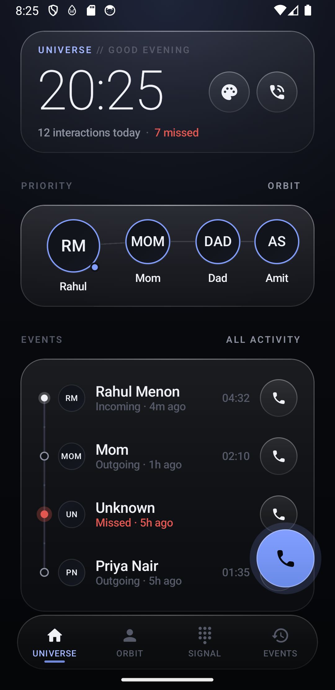
  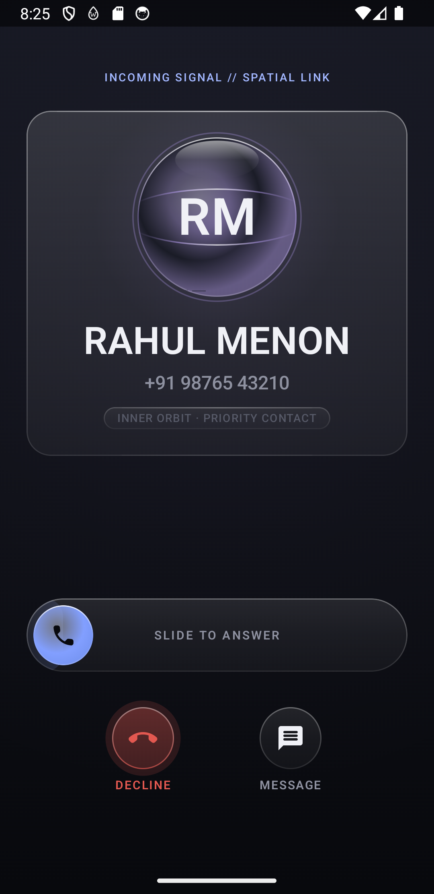
  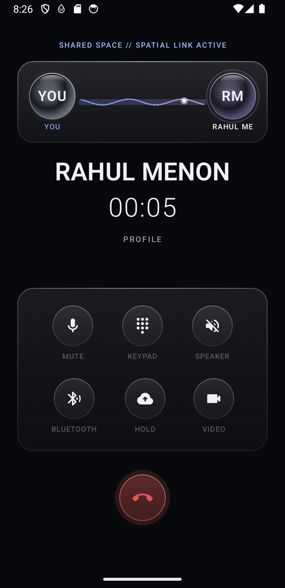
</p>

> **"A futuristic communication operating system built from liquid glass, layered depth, light, and subtle 3D spatial environments."**

**NEXUS** is a next-generation Android personal communication interface built from the ground up with **Kotlin**, **Jetpack Compose**, and a hardware-accelerated **OpenGL ES 2.0 / 3.0** spatial engine. It rethinks the mobile phone and dialer as a living, spatial communication graph — minimal, calm, ultra-responsive, and purposeful without sacrificing daily usability.

---

## 💎 Spatial Glass OS Highlights

### 1. Four-Tier Glass Material System
* **Physical Edge-Lit Optics:** Eliminates heavy real-time GPU blur shaders using multi-stop linear gradients, top specular light highlights, hairline borders, and elevation shadow offsets.
* **Tiered Depth Hierarchy:**
  * **Primary:** Subtle standard surface for background cards, events, and profile overviews.
  * **Secondary:** Elevated glass for slider tracks, list items, and dialer keypads.
  * **Floating:** Highest depth elevation for HUDs, Priority cards, and incoming call overlays.
  * **Minimal:** Ultra-sheer glass for filter pills, small badges, and status chips.

### 2. Translucent Liquid Glass Orbs
* **Zero-Allocation GLSL Shaders:** Per-pixel refractive Fresnel rims, internal fluid caustic waves, top specular environmental light catches, and soft translucent volumetric depth falloff in pure OpenGL ES 2.0 / 3.0.
* **Contextual Light Tints:** Contacts are contextually illuminated according to relationship clusters and interaction recency (Violet, Blue, Amber, Jade, Lavender, Azure).
* **Calm Volumetric Space:** Replaces aggressive sci-fi backgrounds with subtle, calm volumetric dust motes and soft ambient breathing.

### 3. Harmonic In-Call Architecture
* **Continuous Material Transition:** Incoming calls seamlessly dim the ambient environment, raising the hero Liquid Glass Orb and floating glass card into focus.
* **Liquid Glass Thumb Slider:** Translucent glass thumb slider with charging luminous progress wash and haptic snap threshold.
* **Shared Space Orbit:** Active calls link YOU and the CONTACT via an animated fluid harmonic energy stream with pulsating energy beads.
* **In-Call DTMF Sliding Keypad:** Frosted glass touch-tone keypad with live digit accumulator for automated telephone trees.

---

## 📸 Visual Showcase (Spatial Glass OS)

| Universe (Home) | 3D Spatial Orbit | Focused Orb HUD |
|:---:|:---:|:---:|
|  | 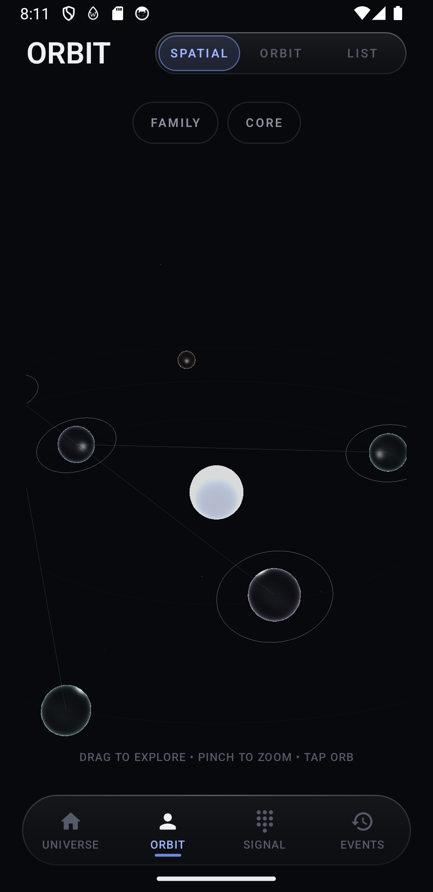 | 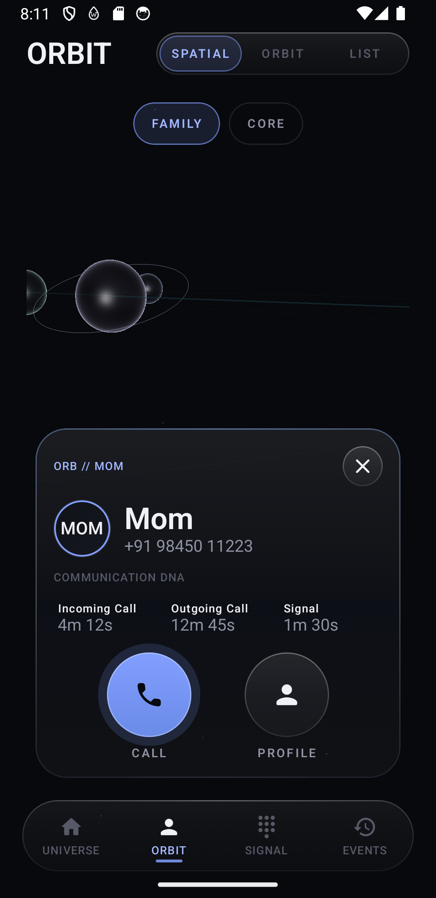 |

| Incoming Call | Active Call (Shared Space) | In-Call DTMF Keypad |
|:---:|:---:|:---:|
|  |  | 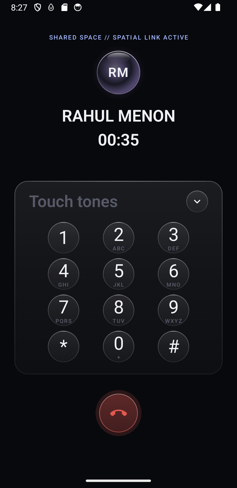 |

| Events Timeline | Contact Profile | Communication DNA |
|:---:|:---:|:---:|
| 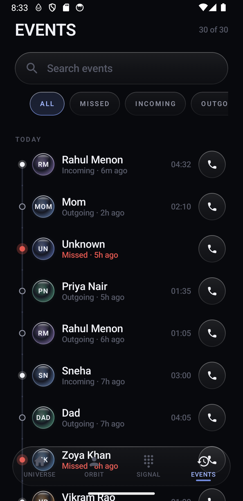 | 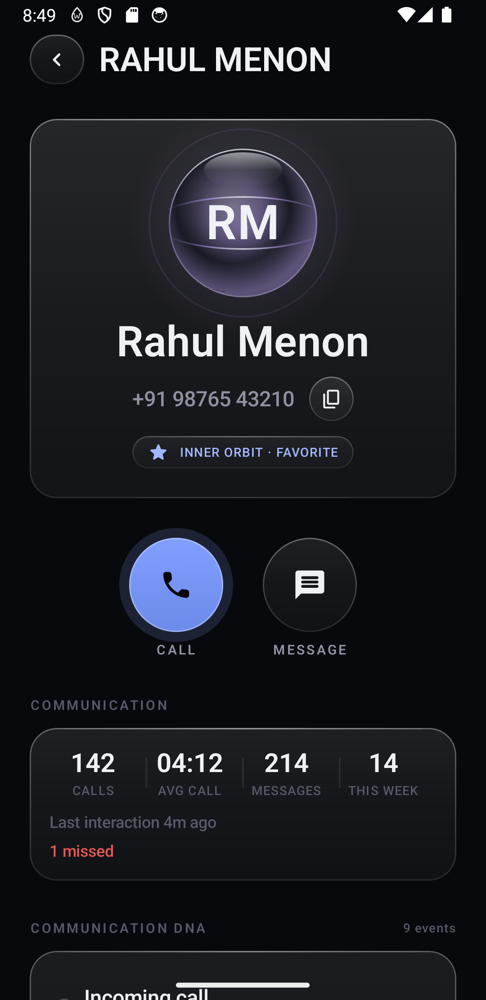 | 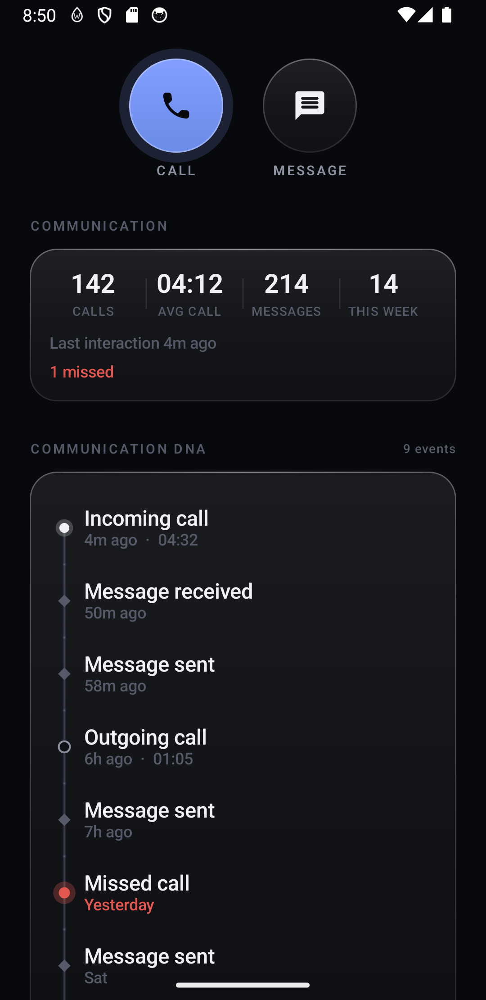 |

| Obsidian Black Mode | Light Paper Glass Mode |
|:---:|:---:|
| 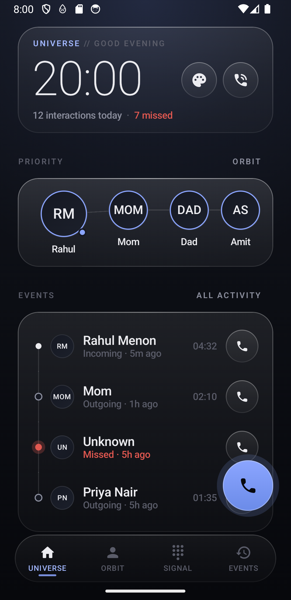 | 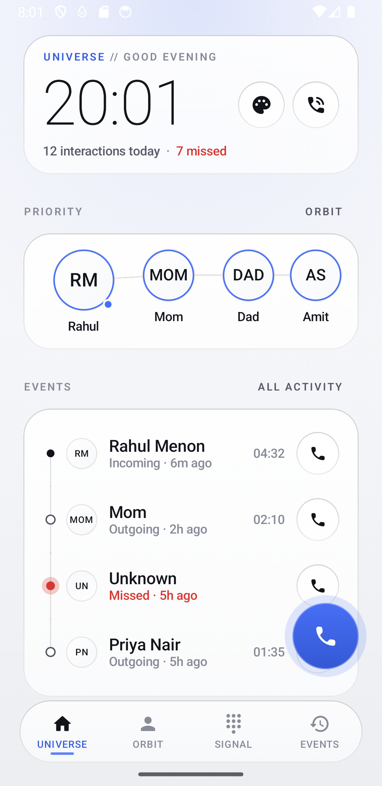 |

---

## 📐 Architecture & Tech Stack

```
com.nexus
├── app/                 NexusApp (shell, navigation graph, floating dock, call router)
├── core/
│   ├── spatial/         3D Spatial Engine & GLSL Shaders
│   │   ├── model/       UniverseState, SpatialContactMapper, CelestialBody, Constellations
│   │   ├── renderer/    UniverseGLRenderer, GLShaders (Liquid Glass & Eclipse), Mesh, ShaderUtil
│   │   └── ui/          UniverseView (Compose AndroidView bridge & 6-DOF touch controller)
│   ├── design/          Spatial Glass System (NexusGlassSurface, LiquidGlassOrb, NexusSwipeToAnswer)
│   ├── theme/           Unified token system (Color, Type, Radii, Spacing, Sizes)
│   ├── animation/       NexusMotion (easing specs, durations, staggers)
│   ├── haptics/         NexusHaptics (intent-driven tactile feedback)
│   └── di/              AppContainer (manual dependency injection)
├── data/
│   ├── model/           Domain models (Contact, CallRecord, ResolvedCall, etc.)
│   ├── contacts/        ContactRepository & MockData
│   └── calls/           CallLogRepository
├── feature/             Screen implementations (home, people, contact, dialer, call, activity)
└── telephony/           CallSessionController (state machine & navigation command router)
```

- **Language:** Kotlin 100%
- **UI Framework:** Jetpack Compose (Compose BOM 2026.03.01)
- **3D Graphics:** Android OpenGL ES 2.0 / 3.0 via GLSurfaceView (Zero GC allocations per frame)
- **Architecture:** Unidirectional Data Flow (UDF), StateFlow, MVVM with Clean Architecture
- **Build System:** Android Gradle Plugin (AGP) 9.4.1
- **Compatibility:** Min SDK 29 / Target SDK 36 / Compile SDK 37

---

## 🚀 Building & Running

1. **Clone the repository:**
   ```bash
   git clone https://github.com/Nairy1729/nexus.git
   cd nexus
   ```

2. **Build and install with Gradle:**
   ```bash
   ./gradlew assembleDebug
   adb install -r app/build/outputs/apk/debug/app-debug.apk
   ```

3. **Launch the application:**
   ```bash
   adb shell am start -n com.nexus.phone.debug/com.nexus.app.MainActivity
   ```

---

## 📚 Architectural Documentation

* [SPATIAL_GLASS_OS.md](SPATIAL_GLASS_OS.md) — Comprehensive specification of the Spatial Glass OS design system, 4-tier glass surfaces, GLSL liquid shaders, and screen architectures.
* [PHASE1_5_SUMMARY.md](PHASE1_5_SUMMARY.md) — Detailed engineering report on the 3D celestial engine, zero-allocation GL renderer, and 6-DOF camera kinematics.
