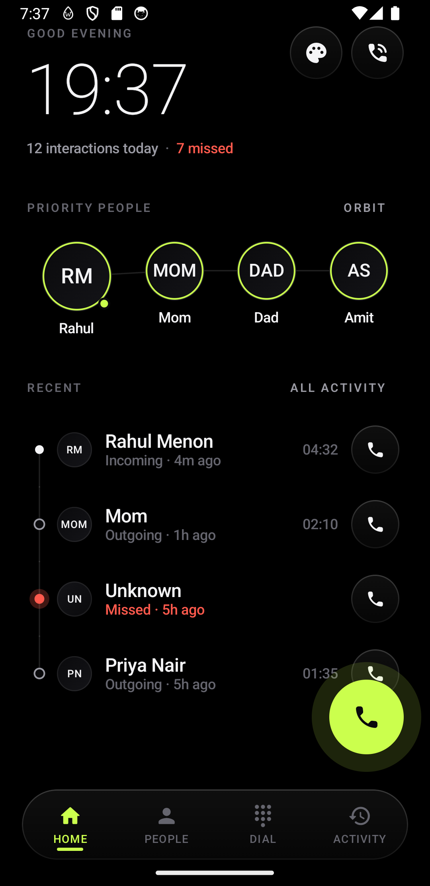
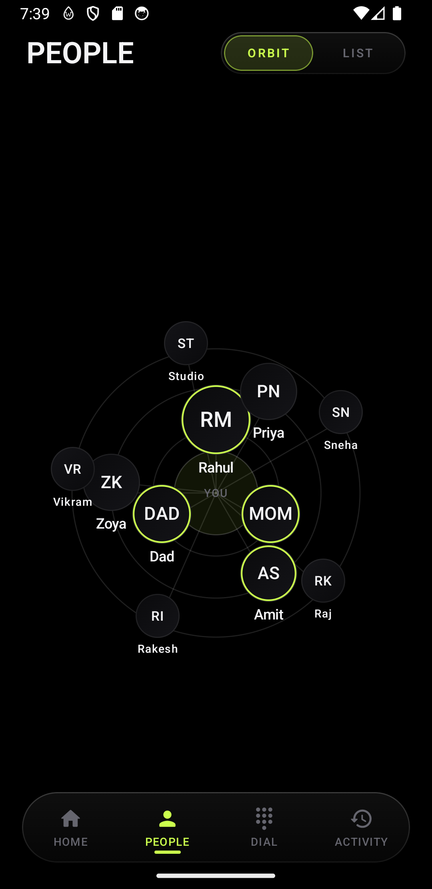
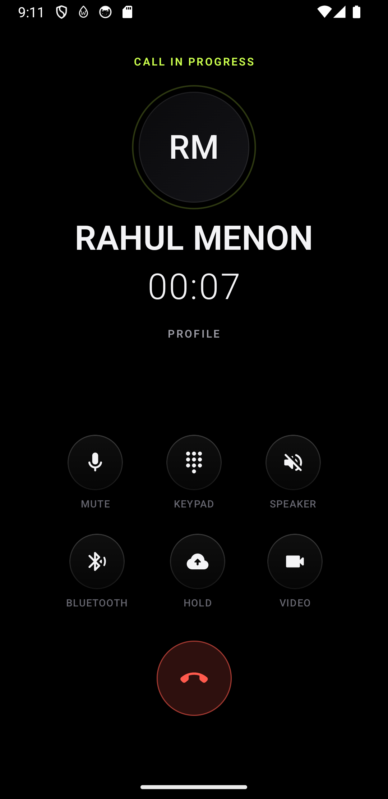
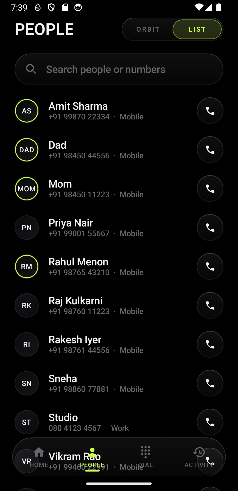
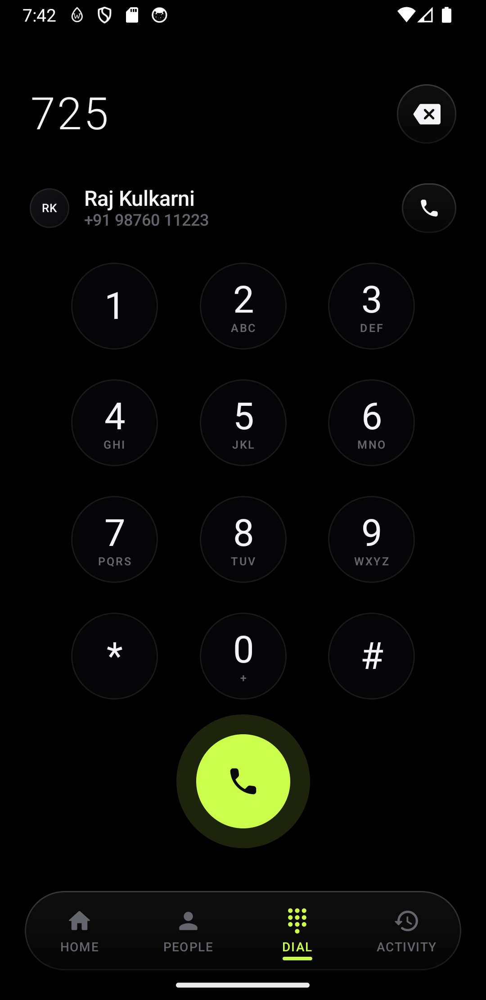
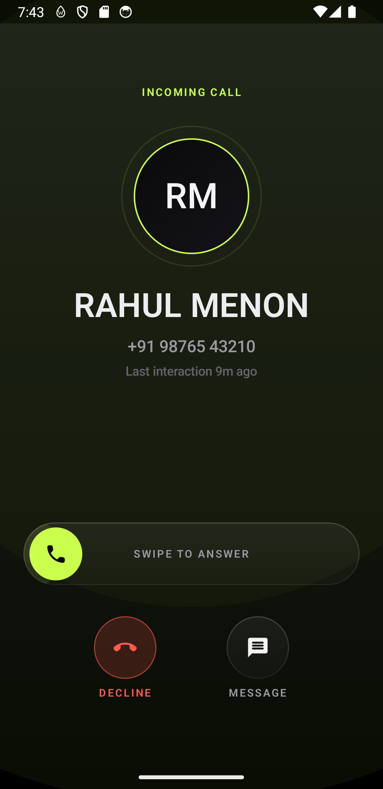
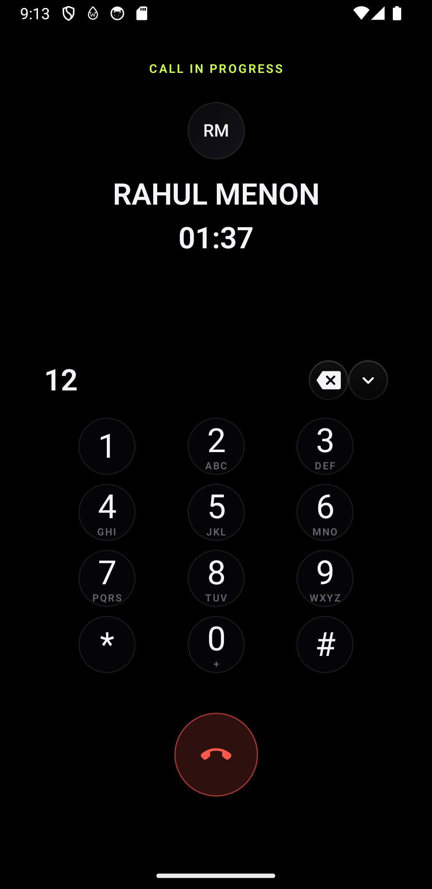
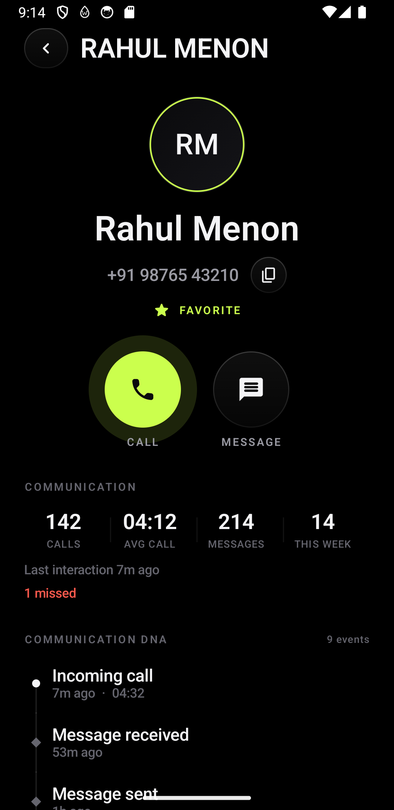
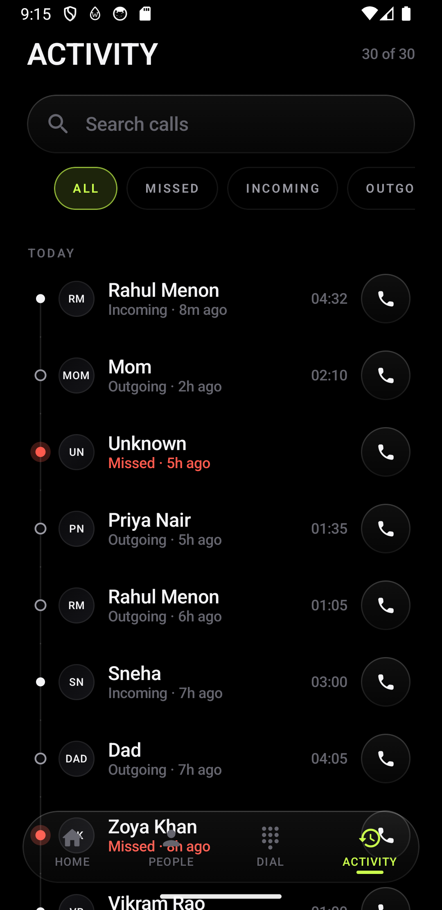

# NEXUS — Futuristic Personal Phone & Communication Interface

<p align="center">
  
  
  
</p>

> **"People are nodes; communication is the connection."**

**NEXUS** is an Android phone and communication interface built from the ground up with **Kotlin** and **Jetpack Compose**. It rethinks the mobile dialer as a living, spatial communication graph — minimal, AMOLED-focused, ultra-responsive, and purposeful without sacrificing daily usability.

---

## Highlights & Features

### 🌌 1. Spatial Orbital Contacts (People)
- **Concentric Orbits:** Contacts positioned dynamically across inner, middle, and outer orbital shells earned by relationship frequency and recency.
- **Direct Manipulation:** Drag nodes to arm quick actions, tap to view full profile.
- **Dual Perspective:** Smooth segmented toggle between spatial **Orbit View** and sorted **List View** with instant search.

### ⏱️ 2. Living Home & Communication Timeline
- **Ambient Time & State:** Large display clock, interaction summary counters, and today's missed call pulse.
- **Priority Node Row:** Immediate single-tap access to primary relationships with distinct first-name badges and status indicator rings.
- **Continuous Timeline Spine:** Chronological timeline showing incoming, outgoing, and missed events connected with status geometry.
- **In-App Palette Switcher:** Seamless cycling between **Dark (AMOLED)**, **Obsidian (Graphite)**, and **Light (Paper)** themes.

### 📞 3. Future-Grade In-Call System
- **Incoming Call:** Concentric pulsating avatar node, primary thumb-zone `Swipe to Answer` slider, and balanced danger-red decline and quick reply actions.
- **Active Call:** Real-time call duration timer, centered `[ PROFILE ]` link, and symmetrical 3×2 control matrix (Mute, Speaker, Bluetooth, Hold, Video).
- **In-Call DTMF Touch Tones:** Sliding in-call keypad for automated phone trees with real-time digit accumulator, backspace, and dismiss.
- **Post-Call Landings:** Calls automatically transition to the recipient's Communication DNA history with complete stats.

### 🧬 4. Communication DNA Profile
- **Relationship Analytics:** Total calls, average duration, message exchanges, and weekly activity.
- **Visual DNA Spine:** Complete interaction event history connecting calls and messages.
- **Dual Action Bar:** Immediate `Call` and `Message` primary triggers.

### ⚡ 5. Intelligent Keypad & T9 Search
- **Touch-Tone Matrix:** Minimalist circular dial keys with clean alphabetic groupings.
- **Live Predictive T9:** Real-time query matching across contact names and phone numbers.

---

## Design System

- **Accent Identity:** Single electric lime `#CBFF4D` accent on deep true AMOLED blacks (`#000000`).
- **Safety Semantics:** Danger red (`#FF5A4D`) reserved exclusively for missed events and call termination.
- **Glassmorphism:** Subtle translucent glass pills and floating dock with frosted borders.
- **Ergonomics & Accessibility:** Strict compliance with $\ge 48\text{dp}$ touch targets, semantic roles, content descriptions, and reduced motion awareness.

---

## Screenshots

| Home | Orbital Contacts | Contact List |
|:---:|:---:|:---:|
|  |  |  |

| T9 Dialer | Incoming Call | Active Call |
|:---:|:---:|:---:|
|  |  |  |

| In-Call Keypad | Contact DNA Profile | Activity History |
|:---:|:---:|:---:|
|  |  |  |

---

## Architecture & Tech Stack

```
com.nexus
├── app/          NexusApp (shell, navigation graph, floating dock, call-command router)
├── core/
│   ├── design/   Reusable design system components (NexusDock, NexusButton, NexusChip, etc.)
│   ├── theme/    Unified token system (Color, Type, Radii, Spacing, Sizes)
│   ├── animation/ NexusMotion (easing specs, durations, staggers)
│   ├── haptics/  NexusHaptics (intent-driven tactile feedback)
│   └── di/       AppContainer (manual dependency injection)
├── data/
│   ├── model/    Domain models (Contact, CallRecord, ResolvedCall, etc.)
│   ├── contacts/ ContactRepository & MockData
│   └── calls/    CallLogRepository
├── feature/      Screen implementations (home, people, contact, dialer, call, activity)
└── telephony/    CallSessionController (state machine & navigation command router)
```

- **Kotlin & Jetpack Compose (Compose BOM 2026.03.01)**
- **Android Gradle Plugin (AGP) 9.4.1**
- **Android Navigation Compose**
- **Material Icons Extended**
- **Min SDK 29 / Target SDK 36 / Compile SDK 37**

---

## Building & Running

1. **Clone the repository:**
   ```bash
   git clone https://github.com/Nairy1729/nexus.git
   cd nexus
   ```

2. **Open in Android Studio or compile via Gradle:**
   ```bash
   # Assemble Debug APK
   ./gradlew :app:assembleDebug

   # Install on connected device/emulator
   ./gradlew :app:installDebug
   ```
